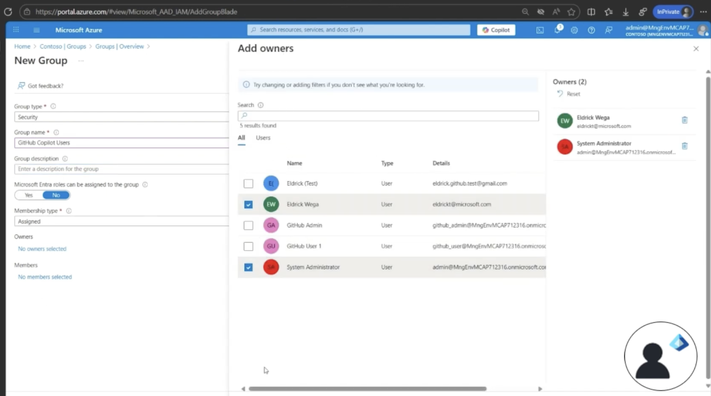
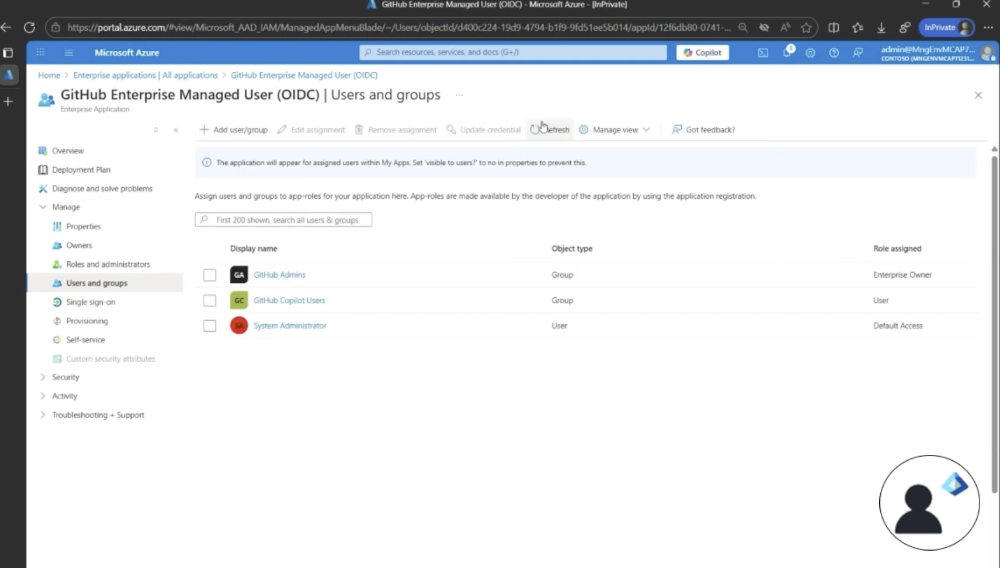
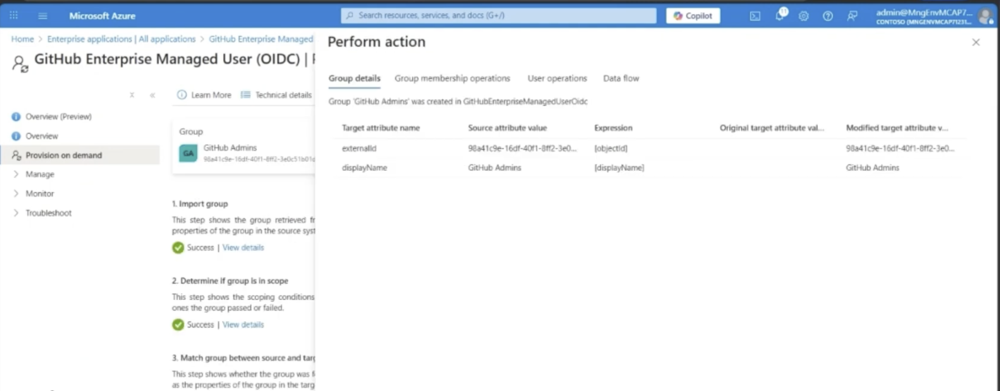

# github-copilot-setup
This guide walks through setting up GitHub and GitHub Copilot end-to-end for your company and link the billing to the Microsoft Azure Subscription. 

## Prerequisites
- Required personas (GitHub Admin, Azure Entra ID Global Admin, Entra ID Subscription Owner)

## Steps

### Entra ID Group Creation
1. Sign in to the [Azure portal](https://portal.azure.com) using an account with Global Admin privileges.
2. Navigate to "Microsoft EntraID" > Groups > "New Groups"
3. Create 2 Groups with admin user selected for both Owners and Members:
    - GitHub-Copilot-Users
    - GitHub-Copilot-Admins

### GitHub Tenant Creation
1. navigate to [GitHub](github.com)
2. Sign in first with the personal account (just to verify that the account creation is done by a real person)
3. From the top right corner, click on your profile picture and select "Enterprises"

4. Click on "New Enterprise"
5. On the enterprise creation page, select *Engerprise with managed users* to have the SSO and user management via Entra ID
6. Fill in the required details and select "Host on Github.com without data residency", and Entra ID as the identity provider. For the Enterprise name, use a name such as "alsowaygh ghcp-enterprise"
7. It is not recommended to change the slug, avoid including characters other than letters and dashes. 
Keep note of the username with the suffex. Click on the create button to create the enterprise.
8. You will receive an email to the email that you used to create the enterprise. The email will include a root user password reset link. Reset the password using the link.
9. Sign in to the enterprise using the root user credentials. (remember that the root admin username will be the <shortname>_admin). You will be taken to the Overview page with some user provisioning steps.
10. Select the SCIM Token to generate the token. Keep the permission as is and click on "Generate Token". *Copy the token and keep it safe as you will not be able to see it again*.
11. Then proceed with the Single sign-on, and setup the OIDC which is recommended for Microsoft EntraID customers. Click on the "Enable OIDC configuration" button. Sign in using using the Azure Global Admin account.and accept the permissions.
12. Save the recovery codes that are generated. These will be needed in case you lose access to the the root account. and then click on "Enable OIDC Authentication"

### Configuring SCIM (User Provisioning)
1. In Microsoft Azure, navigate to Enterprise Applications, and click on GitHub Enterprise Managed User (OIDC)
2. Under the Manage section Navigate to Users and Groups, then click on Add button
3. In the users and groups, assign each of the goups created earlier (GitHub-Copilot-Admins and GitHub-Copilot-Users) to their corresponding roles in GitHub (Enterprise Owner and User respectively)

4. Next, navigate to Provisioning under the Manage section
5. Select the new configuration button, and enter the tenant URL (follow documentation) and change the slug part in the url
6. Then select the token that was created by the GitHub Enterprise Admin (root user earlier).
7. Test the connection and if successful, click on the create button.
8. Once the provisioning is created, click on the "Start Provisioning" button to start the user provisioning. You can monitor the progress from the same page. The default interval is 40 minutes between syncs. (each user added will be pushed within 40 minutes in GitHub). If you do not want to wait, you can click on the "Provision on demand" button to push the changes immediately.

### Provisioning on Demand from Entra ID (Optional)
1. Navigate to Provision on demand
2. Select the groups that were created earlier (GitHub-Copilot-Admins and GitHub-Copilot-Users) 

