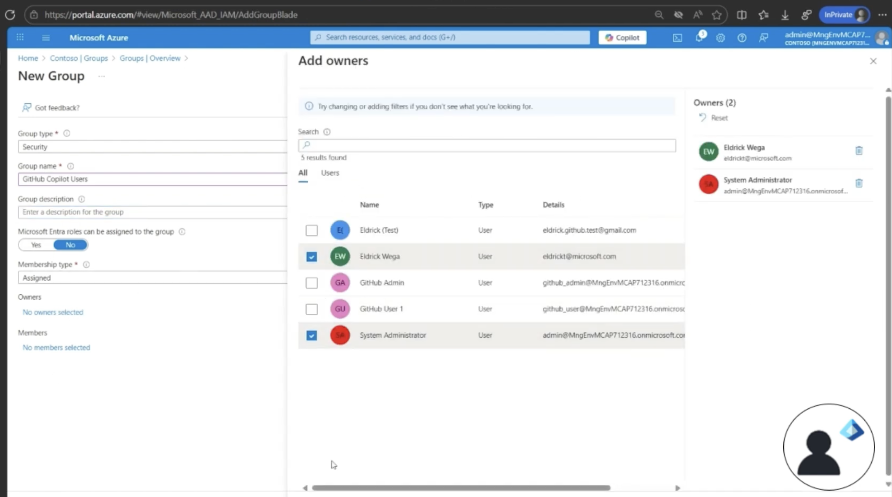
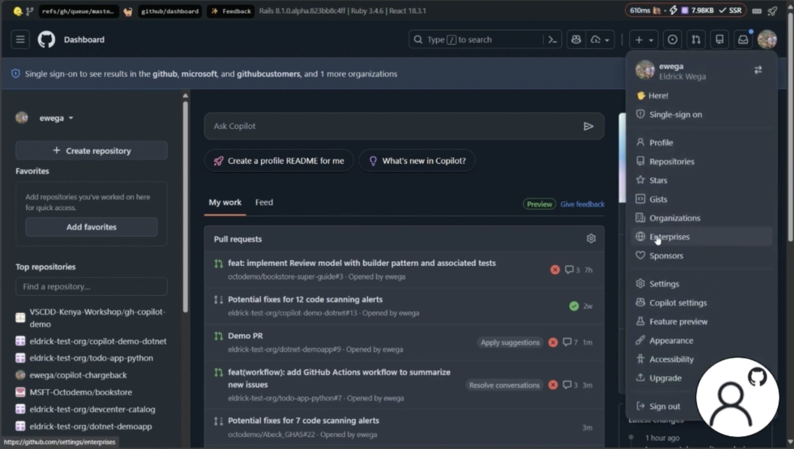
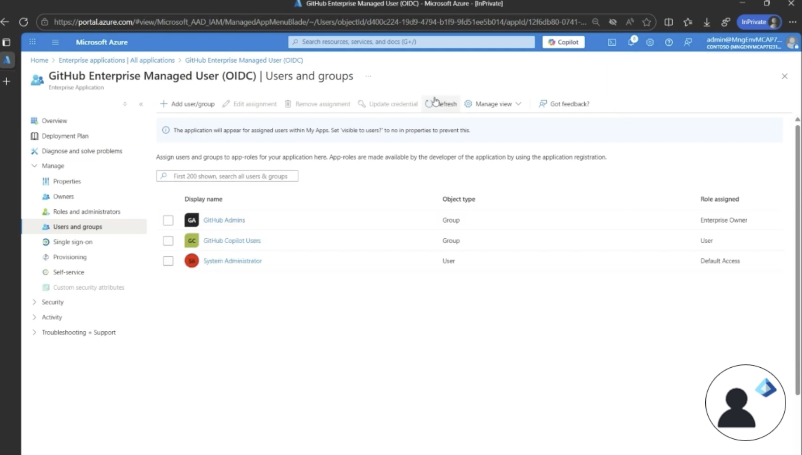
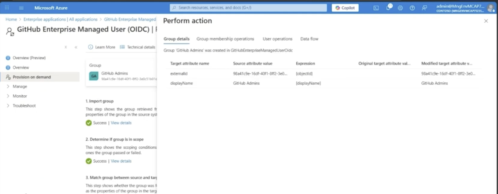
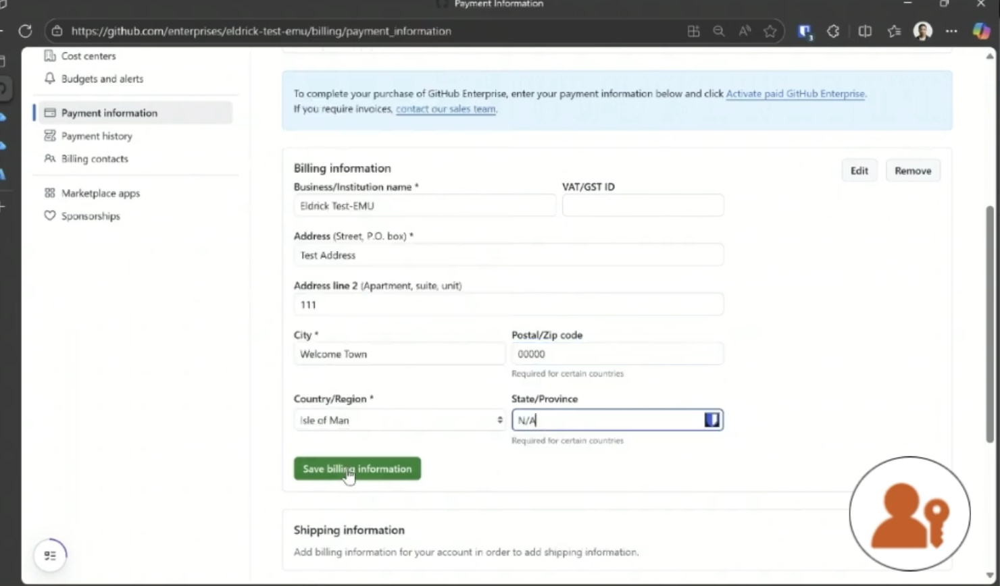
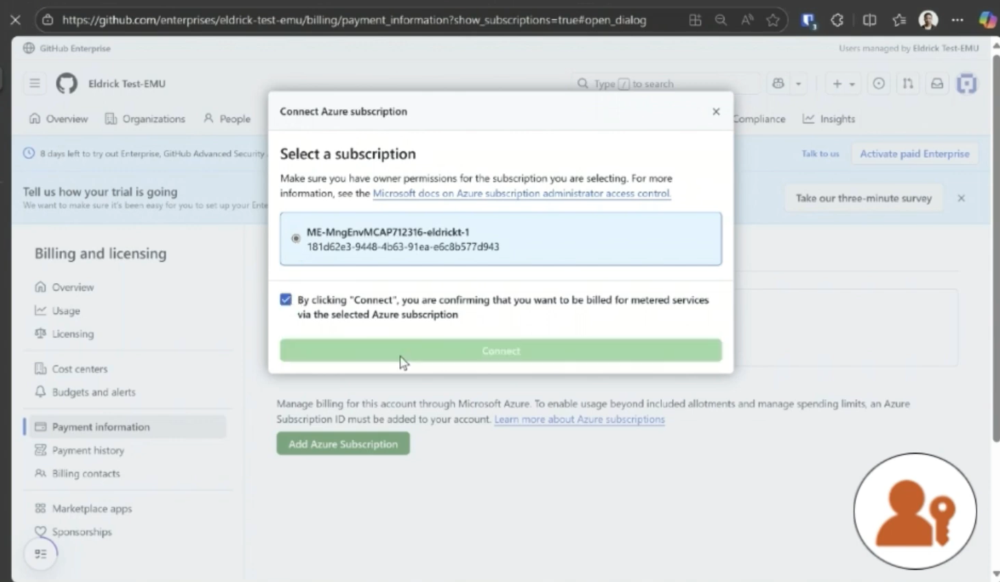
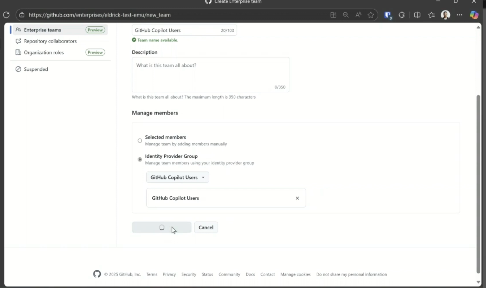
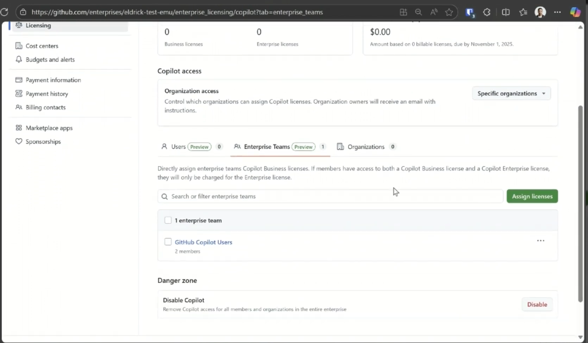

# github-copilot-setup
This guide walks through setting up GitHub and GitHub Copilot end-to-end for your company and link the billing to the Microsoft Azure Subscription. 

## Table of Contents
- [Prerequisites](#prerequisites)
- [Steps](#steps)
    - [Entra ID Group Creation](#entra-id-group-creation)
    - [GitHub Tenant Creation](#github-tenant-creation)
    - [Configuring SCIM (User Provisioning)](#configuring-scim-user-provisioning)
    - [Provisioning on Demand from Entra ID (Optional)](#provisioning-on-demand-from-entra-id-optional)

## Prerequisites
- Required personas (GitHub Admin, Azure Entra ID Global Admin, Entra ID Subscription Owner)

## Steps

### Entra ID Group Creation
1. Sign in to the [Azure portal](https://portal.azure.com) using an account with Global Admin privileges.
2. Navigate to "Microsoft EntraID" > Groups > "New Groups"
3. Create 2 Groups with admin user selected for both Owners and Members:
    - GitHub-Copilot-Users
    - GitHub-Copilot-Admins

### GitHub Tenant Creation
1. navigate to [GitHub](github.com)
2. Sign in first with the personal account (just to verify that the account creation is done by a real person)
3. From the top right corner, click on your profile picture and select "Enterprises"

4. Click on "New Enterprise"
5. On the enterprise creation page, select *Engerprise with managed users* to have the SSO and user management via Entra ID
6. Fill in the required details and select "Host on Github.com without data residency", and Entra ID as the identity provider. For the Enterprise name, use a name such as "alsowaygh ghcp-enterprise"
7. It is not recommended to change the slug, avoid including characters other than letters and dashes. 
Keep note of the username with the suffex. Click on the create button to create the enterprise.
8. You will receive an email to the email that you used to create the enterprise. The email will include a root user password reset link. Reset the password using the link.
9. Sign in to the enterprise using the root user credentials. (remember that the root admin username will be the <shortname>_admin). You will be taken to the Overview page with some user provisioning steps.
10. Select the SCIM Token to generate the token. Keep the permission as is and click on "Generate Token". *Copy the token and keep it safe as you will not be able to see it again*.
11. Then proceed with the Single sign-on, and setup the OIDC which is recommended for Microsoft EntraID customers. Click on the "Enable OIDC configuration" button. Sign in using using the Azure Global Admin account.and accept the permissions.
12. Save the recovery codes that are generated. These will be needed in case you lose access to the the root account. and then click on "Enable OIDC Authentication"

### Configuring SCIM (User Provisioning)
1. In Microsoft Azure, navigate to Enterprise Applications, and click on GitHub Enterprise Managed User (OIDC)
2. Under the Manage section Navigate to Users and Groups, then click on Add button
3. In the users and groups, assign each of the goups created earlier (GitHub-Copilot-Admins and GitHub-Copilot-Users) to their corresponding roles in GitHub (Enterprise Owner and User respectively)

4. Next, navigate to Provisioning under the Manage section
5. Select the new configuration button, and enter the tenant URL (follow documentation) and change the slug part in the url
6. Then select the token that was created by the GitHub Enterprise Admin (root user earlier).
7. Test the connection and if successful, click on the create button.
8. Once the provisioning is created, click on the "Start Provisioning" button to start the user provisioning. You can monitor the progress from the same page. The default interval is 40 minutes between syncs. (each user added will be pushed within 40 minutes in GitHub). If you do not want to wait, you can click on the "Provision on demand" button to push the changes immediately.

### Provisioning on Demand from Entra ID (Optional)
1. Navigate to Provision on demand
2. Select the groups that were created earlier (GitHub-Copilot-Admins and GitHub-Copilot-Users) 

After the provisioning is done, you can navigate to the GitHub Enterprise page and under the Overview you can verify that the "Configure provisioning" step is complete and that the users have been added successfully.

### Adding the Azure Subscription for Billing
1. Login to GitHub using the Enterprise with a user with Admin privileges (Enterprise Owner role) or Billing manager role.
2. Navigate to "Billing and Licensing", then Payment information 
3. Enter the payment information then save as follows: 

4. Make the shipping information the same as the billing information. 
5. The key method here is the payment method, select "Azure Subscription" and click on "Add Azure Subscription"
6. This will direct you to the Azure SSO, sign in with the account that has ownership on the Azure Subscription that you want to link the billing to.
7. Select the subscription and then click on "Connect" button as follows: 

8. Once connected, back to the setting page and click on the green "Activate Github Enterprise" button at the upper part of the page. 

### Assign GitHub Copilot License (users not on GHE)
There are two approaches to assign GitHub Copilot Licenses. The first is using GitHub Enterprise for source code management and assign Copilot licenses. In this case, we will create an organization and teams within the organization to assign the licenses. This is configured through "Billing and Licensing" > "Licensing" > Enable Copilot. Then select the organization instead of teams. 

The second approach is to only create teams directly without an organization and assign GitHub Copilot licenses. In this guide, we will follow the latter approach.

1. Login as a GitHub Enterprise Admin to syncronize groups with Teams in GitHub and assign copilot to this group
2. Navigate to People then Enterprise teams
3. Click on "Create Enterprise team" button 
4. Enter a name that describes the team with copilot such as "GitHub Copilot Users"
5. Select the Identity Provider option and choose GitHub Copilot Users option. then click on "Create Enterprise team"

#### Activate Copilot for the tenant and assign to the created team
1. Navigate to Billing and licensing
2. On the left pane, select Licensing
3. Scroll down and click on "Enable Copilot" button 
4. Once it is enabled, click on the "Enterprise Teams" tab to follow the best practice. 
5. Click on "Assign Licenses" button, and select the GitHub Copilot Users team and confirm. *In this page you can moniitor the number of users that are assigned Copilot licenses*. 

### Configuring GitHub Copilot policies within Github tenant 
1. Navigate to Policies tab
2. Select Copilot on the left pane
3. You can configure multiple policies such as enabling/disabling models, and ignoring certain files from being sent to Copilot, enabling MCP servers and enabling in IDE etc..

